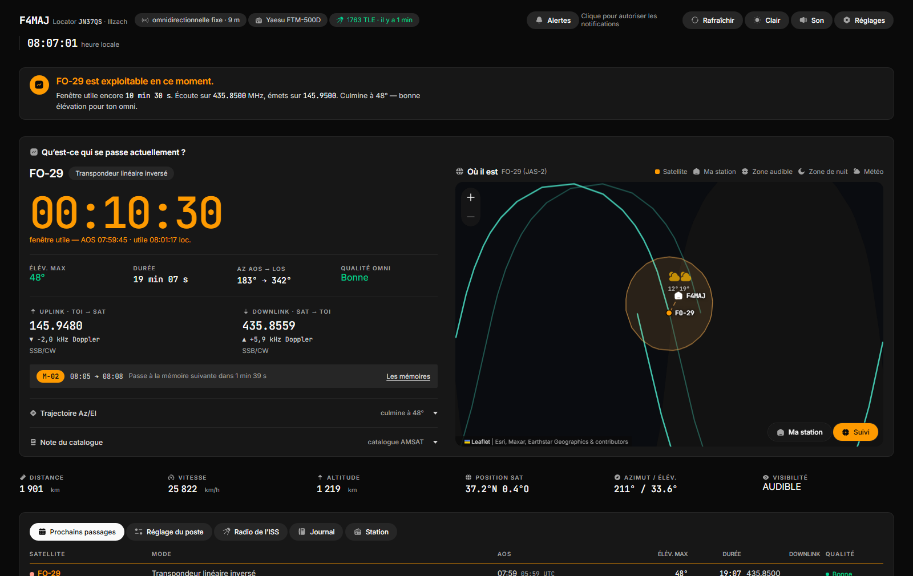

# JB-SATRACK

[](https://github.com/LesF4/jb-satrack/releases/latest)
[](https://github.com/LesF4/jb-satrack/releases)

Suivi des satellites radioamateur et de l'ISS : **quand ça passe, sur quelle fréquence, et quoi régler au poste pour suivre le Doppler**.
Créé par **F4MAJ** (locator JN37QS, Illzach) pour une **antenne omnidirectionnelle fixe** (pas de rotor) et un **Yaesu FTM-500D + Digirig**, mais configurable pour n'importe quelle station. Il tourne en continu sur un petit serveur et se consulte depuis n'importe quel navigateur.



## En bref

- **Pour qui ?** Les radioamateurs qui font du trafic satellite (FM, linéaire, digipeaters, ISS) avec une installation simple, sans rotor ni commande CAT.
- **Ce qui le distingue :** un passage qui culmine très haut est signalé *Zénith* (une antenne verticale a un cône de silence au-dessus de la tête), et le **plan de tuning Doppler** est calculé pour *ce* passage depuis *ta* station, exportable au format CHIRP.
- **Rien à installer pour le calcul :** Python 3.8+ ou l'application Windows, aucune dépendance. La propagation SGP4 tourne dans le navigateur.
- **Démarrer :** sous Windows, télécharge l'installeur ou le zip portable dans les [Releases](https://github.com/LesF4/jb-satrack/releases). Sinon `python3 app.py` puis ouvre <http://127.0.0.1:8073> (Docker : voir [Installation](#installation)). Au premier lancement : **Réglages → indicatif → « Me localiser » → Enregistrer**.

> **Licence.** Le code est publié pour être consulté ; il n'est **pas** sous licence libre. Voir [`LICENSE`](LICENSE) (© F4MAJ, tous droits réservés). Pour l'utiliser ou le partager, demande d'abord l'accord de F4MAJ (ouvre une *issue* sur ce dépôt).

---

## Ce que ça fait

- **Carte du monde temps réel** sur un vrai fond de carte (tuiles OpenStreetMap/Esri, panoramique et zoom à la souris) : position du satellite, trace au sol (une orbite avant / après), empreinte radio, zone de nuit, ligne station↔satellite quand il est en vue.
- **Aperçu météo à la station** : 1 pictogramme (conditions actuelles), 2 si un changement est prévu dans les prochaines heures — semi-transparent, à côté de la maison qui repère la station, sans surcharger la carte.
- **Lectures live** : distance, vitesse, altitude, latitude/longitude, azimut/élévation, visibilité.
- **Prédiction des passages sur 48 h** pour tous les satellites du catalogue, triés par heure, avec AOS/LOS, élévation maximale, durée et azimuts d'entrée/sortie.
- **Note de qualité adaptée à une omni verticale** : un passage rasant est marqué comme tel, et un passage qui culmine au-delà de 75° est signalé « Zénith » car une verticale a un **cône de silence** au-dessus de la tête — c'est le seul tracker qui te dira que le passage « parfait » à 88° est en fait moins bon que celui à 45°.
- **Trajectoire Az/El** (vue polaire) avec la zone de cône de silence matérialisée.
- **Doppler calculé en direct** : fréquences RX/TX corrigées, affichées à la 4ᵉ décimale.
- **Plan de tuning FTM-500D** : le passage est découpé en paliers de 5 kHz avec les horaires exacts, exportables au **format CHIRP** pour préprogrammer les mémoires. Les fichiers CHIRP de satellites qui circulent sont statiques et identiques pour tous ; celui-ci est calculé pour *ce* passage depuis *ta* station, et l'heure de bascule figure dans le commentaire de chaque canal.
- **Alerte avant passage**, sur **trois canaux** qui se rattrapent l'un l'autre : une **pastille dans la page**, un **son**, et la **notification système** du navigateur. Aucun ne suffit seul — la pastille suppose l'onglet visible, la notification système suppose une permission accordée *et* un système qui la laisse passer (sous macOS, le mode Concentration l'avale sans rien dire), le son porte quand l'écran n'est pas regardé. Les seuils sont plus exigeants que ceux de la liste : un passage rasant mérite d'être listé, pas de faire sonner un téléphone.
- **Sons d'interface** : un vocabulaire court et discret, entièrement synthétisé (aucun fichier audio n'est téléchargé). Un clic générique pour la navigation ; des sons distincts et reconnaissables pour ce qui change l'état de la vue — zoom avant/arrière, recentrage sur la station, prise et abandon du suivi, réussite ou échec d'un rafraîchissement. Bouton **Son / Muet** dans l'en-tête, mémorisé par poste.
- **État radio de l'ISS relevé automatiquement** sur la page officielle ARISS toutes les heures : répéteur voix, APRS, SSTV, contacts scolaires, extinctions programmées. Tu sais avant le passage si la radio est en service — et **sur quelle fréquence APRS** (elle bascule entre 145.825 et 437.825 selon la radio utilisée à bord).
- **Journal de trafic** avec export ADIF.
- **TLE rafraîchis automatiquement toutes les heures** depuis plusieurs sources fusionnées (AMSAT, SatNOGS, R4UAB), avec cache local et repli si le réseau tombe.

## Installation

### Docker (recommandé sur JB-SERVER)

```bash
git clone https://github.com/LesF4/jb-satrack.git
cd jb-satrack
docker compose up -d
```

Interface : `http://<ip-de-jb-server>:8073`

Le kiosque HDMI réellement déployé utilise une instance isolée, un lancement
SSH manuel, des limites CPU/RAM et des TLE forcés au démarrage puis chaque
heure. Voir [`docs/JB_SERVER_KIOSK.md`](docs/JB_SERVER_KIOSK.md).

### Sans Docker

Python 3.8+ suffit, **aucune dépendance à installer** :

```bash
python3 app.py            # port 8073
python3 app.py --port 9000
```

Sous Windows, place le dossier sur **D:** (par exemple `D:\jb-satrack`) et lance `python app.py`.

### Application Windows (pour partager sans installer Python)

`packaging/` construit l'application prête à l'emploi — code et interface
inchangés, juste emballés.

```bash
pip install pyinstaller
python packaging/build.py --zip        # -> packaging/dist/JB-SATRACK-portable.zip (à partager)
python packaging/build.py --installer  # -> installeur Inno Setup (Inno Setup requis)
```

Le `.exe` range ses données dans `%LOCALAPPDATA%\JB-SATRACK\` (station.json,
journal, caches) et fonctionne hors ligne dès le premier lancement. Non signé →
avertissement SmartScreen au 1er lancement : **Informations complémentaires →
Exécuter quand même**. Détails : [`packaging/README.md`](packaging/README.md).

Un `PREMIER-DEMARRAGE.txt` accompagne l'exe (et l'installeur affiche la licence
F4MAJ) : il explique à celui qui installe l'appli comment régler sa station —
**Réglages → indicatif → « Me localiser » → Enregistrer**.

La CI (`.github/workflows/build.yml`) reconstruit portable + installeur à chaque
tag `v*` et les joint à la Release GitHub correspondante.

## Configuration

Tout est dans `data/station.json`, créé au premier démarrage :

```json
{
  "callsign": "F4MAJ",
  "locator": "JN37QS",
  "lat": 47.7719, "lon": 7.3444, "alt_m": 240,
  "antenna": {"type": "omnidirectionnelle fixe", "height_m": 9, "rotor": false, "cone_of_silence_deg": 75},
  "rig": {"model": "Yaesu FTM-500D", "cat": false, "soundcard": "Digirig", "tuning_step_khz": 5},
  "min_elevation_deg": 5,
  "forecast_hours": 48,
  "alert": {"lead_min": 10, "min_elevation_deg": 20, "skip_zenith": true}
}
```

- `min_elevation_deg` : passages ignorés en dessous (5° par défaut ; monte à 10° si l'horizon est bouché).
- `cone_of_silence_deg` : seuil au-delà duquel un passage est signalé « Zénith ».
- `forecast_hours` : horizon de prédiction.
- `alert` : réglages de la notification avant passage. `lead_min` = combien de minutes
  d'avance ; `min_elevation_deg` = élévation en dessous de laquelle on ne dérange pas
  (volontairement plus haut que celui du dessus) ; `skip_zenith` = ne pas annoncer les
  passages qui culminent dans le cône de silence de l'antenne.
  L'interrupteur, lui, est le bouton **Alertes** de l'en-tête : la permission de notifier
  se demande par navigateur, elle ne peut pas venir d'un fichier.

La fenêtre **Réglages** (bouton dans l'en-tête) permet de saisir indicatif, locator,
ville et fuseau à la main. Sous le champ Locator, **« Me localiser »** prend la
position de l'ordinateur (utile en déplacement, quand on ne connaît pas son locator
exact) : il remplit le locator, la ville (via OpenStreetMap) et le fuseau. La
permission de géolocalisation se demande au navigateur ; ça marche depuis
`localhost` / `127.0.0.1`. À l'enregistrement, la maison se déplace sur la carte,
la vue se recentre et tous les passages sont recalculés.

Le catalogue est **automatique** : tous les satellites radioamateurs trafiquables (FM, linéaire, digipeater) d'après le [statut AMSAT](https://www.amsat.org/status/), + ISS, fréquences SatNOGS, reconstruit chaque jour (`satcatalog.py`, cache `data/catalog_auto.json`). `data/satellites.json` contient les entrées **vérifiées à la main**, toujours présentes et prioritaires : c'est là qu'on corrige une fréquence ou une tonalité CTCSS.

## Méthode de travail avec le FTM-500D

Le FTM-500D **n'a pas de commande CAT** : son port USB sert à la programmation et, avec le Digirig, à l'audio + PTT. Le Doppler ne peut donc pas être corrigé automatiquement par le poste. La méthode retenue est celle des opérateurs FM :

1. Ouvre le passage dans l'interface, clique « Exporter pour CHIRP ».
2. Charge les 5 canaux dans le poste (logiciel de programmation Yaesu).
3. Pendant le passage, l'interface surligne le palier courant : tu changes de mémoire au moment indiqué.

En bande basse (145 MHz) le Doppler est d'environ ±3 kHz, en 435 MHz d'environ ±10 kHz : c'est en UHF que le suivi compte vraiment.

**Pour un Doppler automatique**, deux voies : un poste avec CAT (IC-9700, FT-991A), ou une clé RTL-SDR branchée sur JB-SERVER pour la réception (le serveur corrige alors tout seul et peut enregistrer/décoder). Non implémenté pour l'instant.

## Précision

- Propagation **SGP4** via [satellite.js](https://github.com/shashwatak/satellite-js), la même famille d'algorithmes que Gpredict ou SatPC32. Le serveur télécharge la bibliothèque au premier lancement et la met en cache dans `data/vendor/`.
- Éléments orbitaux depuis **AMSAT + SatNOGS + R4UAB** (fusionnés, l'orbite la plus récente gagne ; CelesTrak reste un repli). Rafraîchis toutes les heures. Un TLE de moins de 24 h donne une précision de l'ordre de la seconde sur les heures de passage.
- Les fréquences du catalogue sont vérifiées manuellement (sources AMSAT, F5SVP). Un satellite peut tomber en panne ou changer de mode : **vérifie [amsat.org/status](https://www.amsat.org/status/) avant un QSO important**. Le statut ISS, lui, est relevé automatiquement.
- Carte : imagerie satellite **Esri World Imagery** (fond + libellés/frontières) via [Leaflet](https://leafletjs.com/), mise en cache localement comme satellite.js. Aucune clé requise, mais nécessite Internet pour charger les tuiles (le reste de l'appli continue de fonctionner hors-ligne une fois la page chargée).
- Icônes : **[Reicon](https://reicon.dev/icons?weight=filled)** (graisse *Filled*, licence MIT). Chaque icône est récupérée à l'unité depuis le paquet npm `reicon` (version épinglée), son tracé est extrait et mis en cache en SVG local dans `data/vendor/icons/` — même principe que satellite.js. **Toute** icône de l'interface vient de cette banque : voir [`web/icons.js`](web/icons.js).
- Météo : [Open-Meteo](https://open-meteo.com/) (gratuit, sans clé), à la station uniquement, rafraîchie toutes les 30 min.
- Le calcul satellite se fait dans le navigateur : le serveur ne fait que servir les données.

## API

| Route | Rôle |
|---|---|
| `GET /api/station` · `POST /api/station` | configuration de la station |
| `GET /api/satellites` | catalogue fréquences/modes |
| `GET /api/tle` · `GET /api/tle/refresh` | éléments orbitaux (cache 1 h) |
| `GET /api/iss-status` · `/refresh` | état radio ISS (ARISS, cache 1 h) |
| `GET /api/weather` · `/refresh` | météo à la station, maintenant + prévision courte (cache 30 min) |
| `GET /api/reverse?lat=&lon=` | nom de commune depuis des coordonnées (bouton « Me localiser », via OpenStreetMap) |
| `GET /api/qso` · `POST /api/qso` | journal de trafic |
| `GET /api/qso.adi` | export ADIF |
| `GET /api/health` | état du serveur |
| `GET /vendor/icon/<Nom>.svg` | icône Reicon *Filled* (récupérée puis mise en cache localement) |

Ces routes sont exploitables par **JB-AI** : par exemple interroger `/api/tle` et `/api/iss-status` pour annoncer vocalement le prochain passage exploitable.

## Structure

```
app.py                 serveur (bibliothèque standard Python uniquement)
DESIGN.md              système de design — palette, règles, décisions, mesures
PRODUIT.md             cadrage produit — pour qui, contre quoi, ce qui a été écarté
data/satellites.json   entrées vérifiées à la main (prioritaires) — éditable
data/catalog_auto.json catalogue automatique (généré chaque jour, ne pas éditer)
data/station.json      configuration station (créé au 1er lancement)
data/vendor/           satellite.js, leaflet.js/css, icônes Reicon, polices — cache 1er lancement
web/index.html         interface
web/app.js             calculs SGP4, passages, Doppler, carte Leaflet, suivi, météo
web/icons.js           banque d'icônes Reicon (SVG servis via /vendor/icon/<Nom>.svg)
web/style.css          système de design (deux thèmes)
tests/                 stub hors ligne pour tests d'interface
```

## Interface

Une page, organisée autour d'une question : **qu'est-ce qui se passe actuellement ?**
En tête, une phrase en français dit ce qui se passe et ce qu'il faut en faire. Puis le
passage suivi à gauche (compte à rebours, fréquences corrigées du Doppler, palier de
mémoire courant) et la carte à droite. La télémétrie tient sur une bande. Le reste —
prochains passages, plan de tuning, radio de l'ISS, journal, station — est derrière des
onglets en pied de page.

**Thème clair / sombre** au bouton dans l'en-tête, sombre par défaut, choix mémorisé.

**Son** au bouton voisin, coupé d'un clic, mémorisé de la même façon. Si le système
demande moins d'animations (`prefers-reduced-motion`), le son est **muet par défaut** —
il n'existe pas de préférence système équivalente pour le son, celle-ci en tient lieu.
Un choix explicite l'emporte dans les deux sens.

**Alertes** : le clic qui les active **envoie aussitôt une annonce de
confirmation** — tu vois et tu entends sur-le-champ ce qui sortira le jour J, sans
attendre un passage. Les seuils (délai, élévation minimale) se règlent dans
`data/station.json`, sous `alert`.

**Pastilles d'alerte** : elles s'écartent d'un clic ou **en les glissant vers la droite**.
Leur compte à rebours mesure ta **présence**, pas l'horloge : tant que la page est cachée
ou qu'un autre logiciel a le focus, la pastille attend ; dès que tu reviens, elle tient
cinq secondes puis s'efface. Une annonce partie pendant ton absence est donc toujours là
à ton retour.

**Carte** : molette proportionnelle au geste (Leaflet sature à 4 niveaux par rafale, sa
molette native est débranchée), pincement trackpad réglé à part, monde borné — pas de
duplication au dézoom — et **suivi du satellite** qui se coupe au premier geste et se
reprend au bouton ou par la touche `S`.

**Polices** : Inter et JetBrains Mono sont téléchargées une fois puis mises en cache dans
`data/vendor/fonts/`, comme satellite.js et Leaflet — l'exécutable autonome garde donc sa
typographie hors ligne.

Les décisions de conception, les valeurs exactes et les contrastes mesurés sont dans
[`DESIGN.md`](DESIGN.md).

## Limites connues

- Pas de commande CAT du poste (limitation matérielle du FTM-500D).
- Le catalogue de fréquences couvre les satellites principaux ; un satellite suivi mais absent de toutes les sources TLE n'aura pas de position (l'interface l'indique).
- L'analyse de la page ARISS repose sur son texte : si ARISS change la mise en page, le statut peut passer en « inconnu » — l'interface affiche alors le lien vers la page d'origine.
- **La notification système n'existe que si la page est ouverte.** Il n'y a pas de service worker : c'est l'onglet qui surveille l'heure. Navigateur fermé, aucune alerte ne part — la pastille et le son non plus. C'est un choix assumé (voir [`DESIGN.md`](DESIGN.md)), pas un oubli.
- Le son ne peut démarrer qu'après un premier clic dans la page : les navigateurs refusent d'ouvrir un contexte audio sans geste de l'utilisateur. Un onglet rouvert et jamais cliqué reste donc silencieux jusqu'au premier clic.
- Les icônes sont récupérées au premier lancement (comme satellite.js / Leaflet) : sans Internet à ce moment-là, l'interface s'affiche sans icône (le texte reste lisible), puis les icônes apparaissent une fois la connexion revenue.

## Documentation

Toute la doc technique est dans [`docs/`](docs/README.md) :
[Architecture](docs/ARCHITECTURE.md) · [API HTTP](docs/API.md) ·
[Fichiers de données](docs/DONNEES.md) · [Exploitation & diagnostic](docs/OPERATIONS.md) ·
[Décisions](docs/DECISIONS.md) · [État](docs/ETAT.md) · [Journal](docs/JOURNAL.md) ·
[TODO](docs/TODO.md).
Versions : [`CHANGELOG.md`](CHANGELOG.md) · Notes agents : [`CLAUDE.md`](CLAUDE.md) ·
Produit : [`PRODUIT.md`](PRODUIT.md).

---

Station F4MAJ · JN37QS · Illzach

© 2026 F4MAJ — Tous droits réservés.
Icônes : [Reicon](https://reicon.dev) (MIT) · cartes [Esri](https://www.esri.com/) via [Leaflet](https://leafletjs.com/) · calcul [satellite.js](https://github.com/shashwatak/satellite-js) (MIT).
